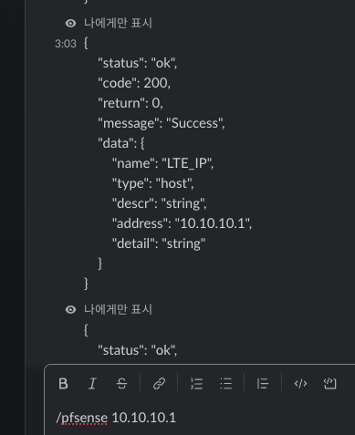
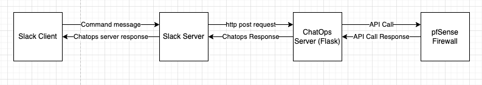

# jenny coffee ChatOps

- for Slack chat receiver
- docs: https://developers.cloudflare.com/workers/tutorials/build-a-slackbot/
- .env

```
SLACK_WEBHOOK=https://hooks.slack.com/services/...
SLACK_TOKEN=...
BOT_PFSENSE_BOT_URL=http://<PFSENSE URL>
BOT_PFSENSE_ID=<PFSENSE ID>
BOT_PFSENSE_PW=<PFSENSE PW>
BOT_PFSENSE_SECRET=<BOT EVENT SECRET> # slack server to chatops Server
```

- .gitignore

```
.env
```

# Add bot

- `bots/pfsense.py`
- `bots/your_want_botname.py`
- `run.py` to add bot

```
from bots.pfsense import Pfsenses
api.add_namespace(Pfsenses, '/pfsense')
```

# Run bot

```
screen -S slackbot
nohup python3 run.py
```

- After, `Ctrl + A + D` to detach

# See logs

```
tail -f nohup.out
```

# Usage



# Structure


